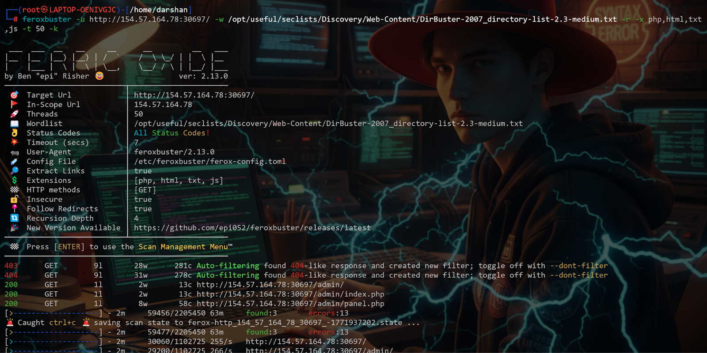
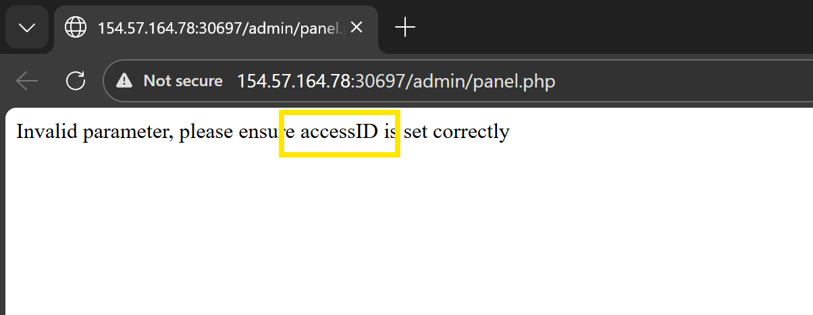
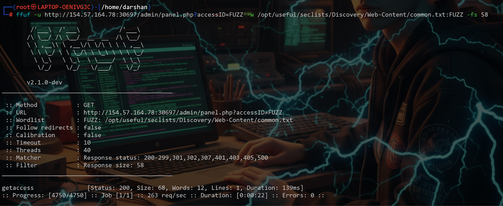
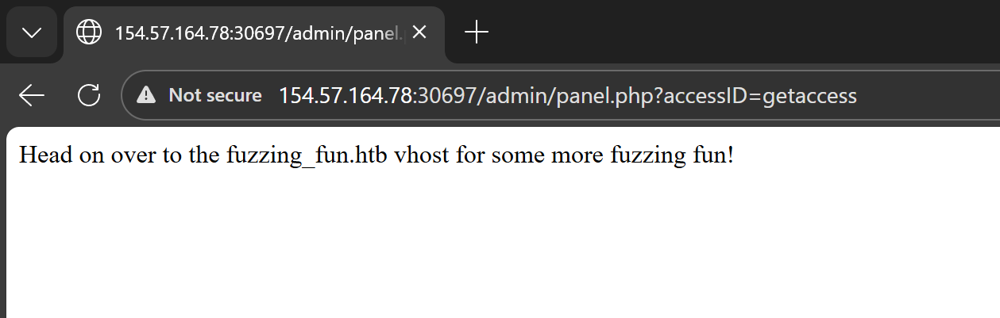
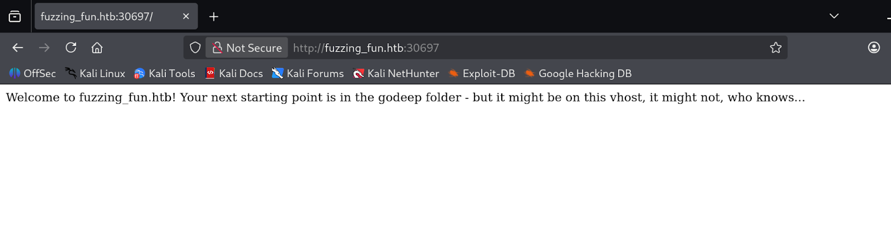
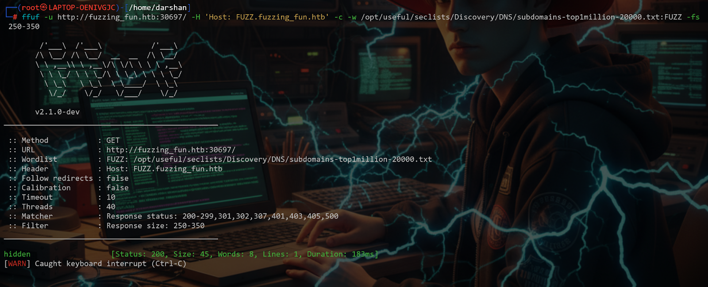
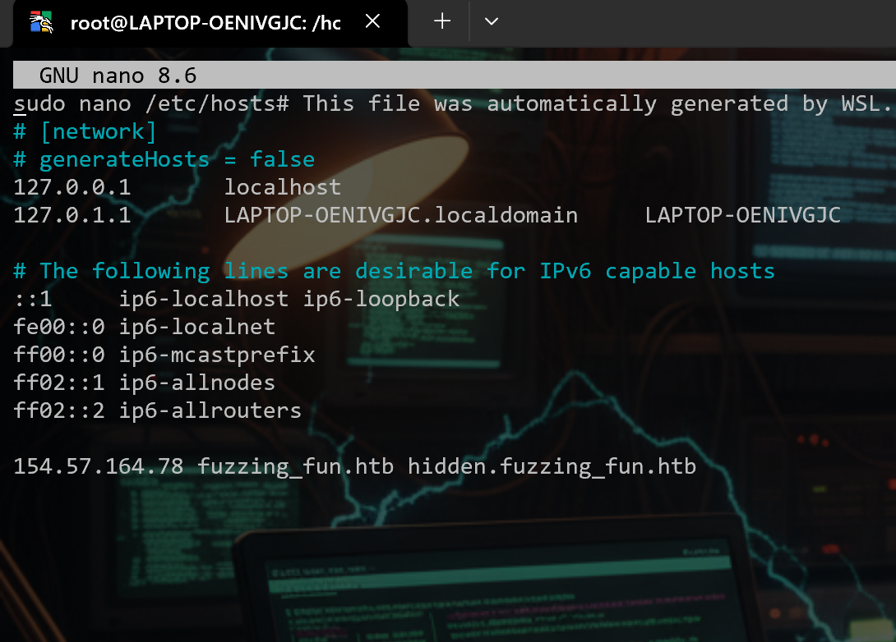
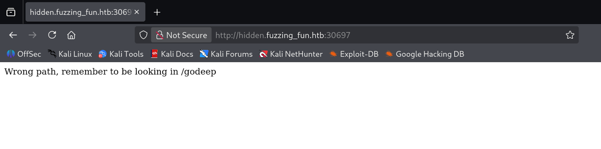
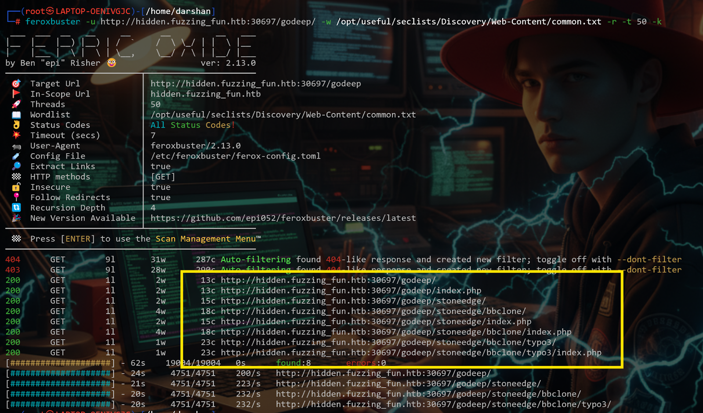
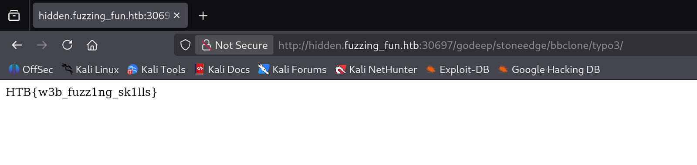

# Topic 7 — Skill Assessment

> [← Back to Web Fuzzing](../README.md)

---

## 🎯 Objective
Chain together all fuzzing techniques learned in the module to find a hidden flag — recursive discovery, VHost fuzzing, subdomain discovery, and deep directory scanning.

---

## 🪜 Steps

### Step 1 — Recursive discovery with Feroxbuster
Run recursive scan on the target. Found 3 responses with **200 OK** including an `/admin` panel.

Opening `/admin` in browser → `"Access Denied"`



---

### Step 2 — Fuzz for accessID
Tried all discovered paths. One requires an `accessID` parameter.



Fuzz the `accessID` using ffuf:
```bash
ffuf -w /usr/share/seclists/Discovery/Web-Content/directory-list-2.3-medium.txt \
  -u "http://IP:PORT/admin?accessID=FUZZ"
```

**Found accessID: `fuzzing_fun.htb`**



---

### Step 3 — Add hostname to /etc/hosts
The accessID is a hostname — add it to resolve locally:
```bash
sudo nano /etc/hosts
# Add:  IP  fuzzing_fun.htb
```

Opening `fuzzing_fun.htb` in browser gives a **hint**.




---

### Step 4 — Fuzz for subdomains
Run subdomain fuzzing on `fuzzing_fun.htb`:
```bash
gobuster dns -d fuzzing_fun.htb \
  -w /usr/share/seclists/Discovery/DNS/subdomains-top1million-5000.txt
```

**Found hidden subdomain: `hidden.fuzzing_fun.htb`**



---

### Step 5 — Add subdomain to /etc/hosts
```bash
sudo nano /etc/hosts
# Add:  IP  hidden.fuzzing_fun.htb
```



Open `hidden.fuzzing_fun.htb:PORT` in browser — it hints the directory is at `/godeep`.



---

### Step 6 — Directory scan on /godeep
```bash
ffuf -w /usr/share/seclists/Discovery/Web-Content/directory-list-2.3-medium.txt \
  -u "http://hidden.fuzzing_fun.htb:PORT/godeep/FUZZ"
```

Got various results — checked each one.



---

### Step 7 — Flag discovered!



---

## ✅ Result
Flag found by chaining:
1. Recursive directory scan → found `/admin`
2. Parameter fuzzing → found `accessID = fuzzing_fun.htb`
3. VHost/subdomain fuzzing → found `hidden.fuzzing_fun.htb`
4. Deep directory scan → found flag in `/godeep`

---

## 💡 Key Takeaway
Real-world targets require chaining multiple fuzzing techniques. No single tool or method gives the full picture — recursive + parameter + subdomain + deep directory scanning together is how you find what's actually hidden.
