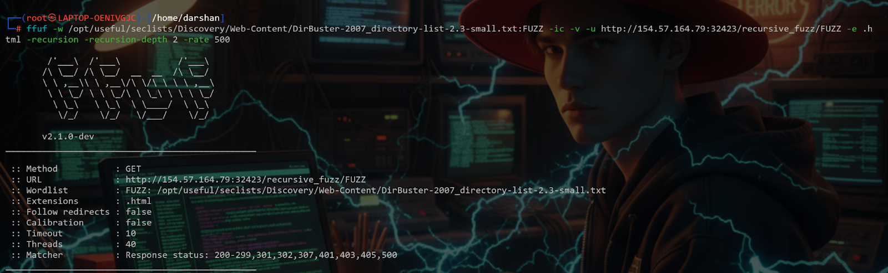
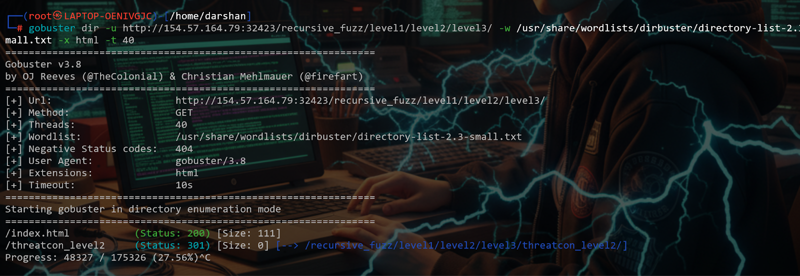
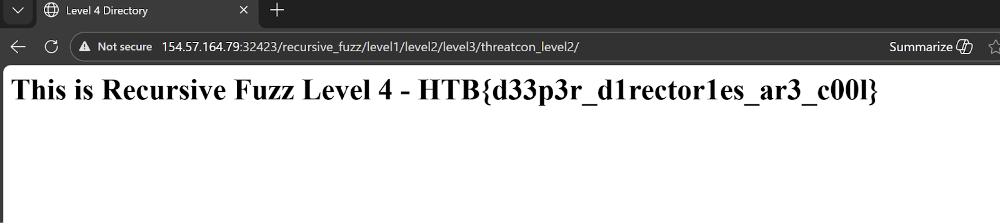

# Topic 1 — Recursive Fuzzing

> [← Back to Web Fuzzing](../README.md)

---

## 📖 What is Recursive Fuzzing?

Recursive fuzzing with `ffuf -recursion` automatically continues fuzzing inside every discovered directory. Instead of just finding top-level folders, it digs deeper — level1 → level2 → level3 — automatically.

---

## 🎯 Challenge
> Recursively fuzz the `/recursive_fuzz/` path on the target to find the flag.

---

## 🪜 Steps

### Step 1 — Initial directory enumeration with ffuf
Run ffuf with recursion enabled:
```bash
ffuf -w /usr/share/seclists/Discovery/Web-Content/directory-list-2.3-medium.txt \
  -u http://IP:PORT/recursive_fuzz/FUZZ \
  -recursion \
  -recursion-depth 4 \
  -mc 200,301,302,403
```

Found nested directories: `level1/level2/level3`




---

### Step 2 — Access the final directory with Gobuster
```bash
gobuster dir -u http://IP:PORT/recursive_fuzz/level1/level2/level3/ \
  -w /usr/share/seclists/Discovery/Web-Content/directory-list-2.3-medium.txt
```



---

## 🚩 Flag
```
HTB{d33p3r_d1rector1es_ar3_c00l}
```



---

## 💡 Key Takeaway
Always use recursive fuzzing on real targets — sensitive files are often buried deep inside nested directories that a single-level scan would miss.
