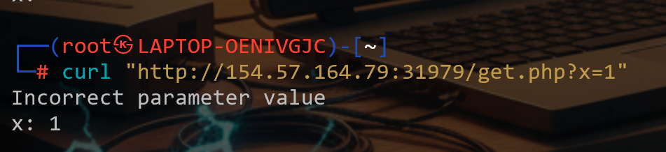
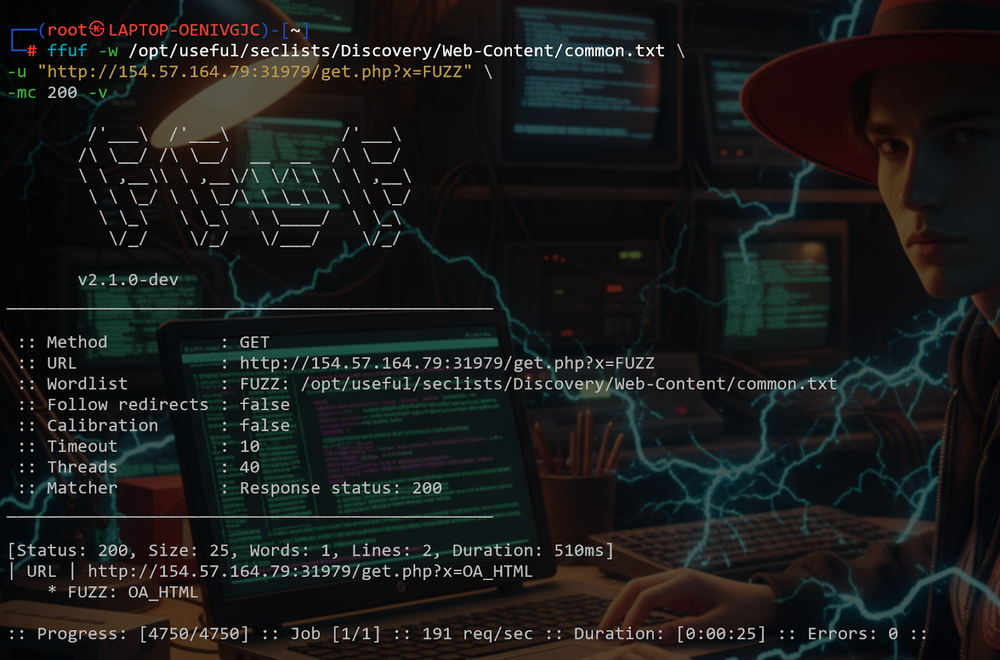
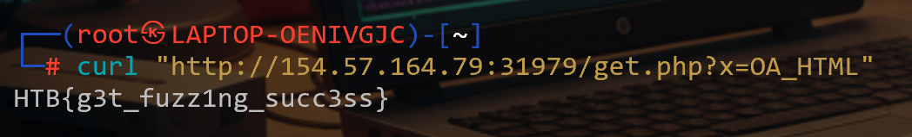
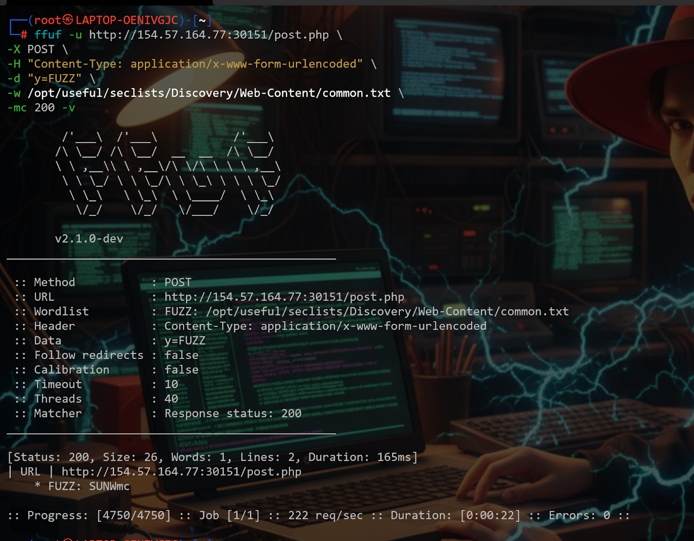
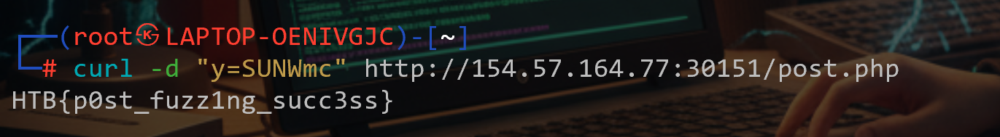

# Topic 2 — Parameter and Value Fuzzing

> [← Back to Web Fuzzing](../README.md)

---

## 📖 What is Parameter Fuzzing?

Parameter and value fuzzing means testing different inputs in URL or POST parameters to find the correct value that triggers a different or interesting server response.

Tools used: **ffuf** and **wenum** (both work the same way).

---

## 🎯 Challenge Part 1 — GET Parameter Flag

### Step 1 — Confirm parameter exists
```bash
curl "http://IP:PORT/get.php?x=test"
```


---

### Step 2 — Fuzz the GET parameter with ffuf
```bash
ffuf -w /usr/share/seclists/Discovery/Web-Content/burp-parameter-names.txt \
  -u "http://IP:PORT/get.php?x=FUZZ"
```
Found directory: `OA_HTML`



---

### Step 3 — Confirm the flag
```bash
curl "http://IP:PORT/get.php?x=OA_HTML"
```


---

## 🎯 Challenge Part 2 — POST Parameter Flag

### Step 1 — Fuzz the POST parameter
```bash
ffuf -w /usr/share/seclists/Discovery/Web-Content/burp-parameter-names.txt \
  -u "http://IP:PORT/post.php" \
  -X POST \
  -d "y=FUZZ" \
  -H "Content-Type: application/x-www-form-urlencoded"
```
- `-X POST` → send a POST request
- `-d "y=FUZZ"` → sends data in the request body
- `-H` → sets Content-Type to HTML form format

Found directory: `SUNWmc`



---

### Step 2 — Confirm the flag
```bash
curl -X POST "http://IP:PORT/post.php" -d "y=SUNWmc"
```


---

## 💡 Key Takeaway
Both GET and POST parameters can hide sensitive endpoints. Always fuzz both — many apps expose functionality only via POST that's invisible to directory scanners.
