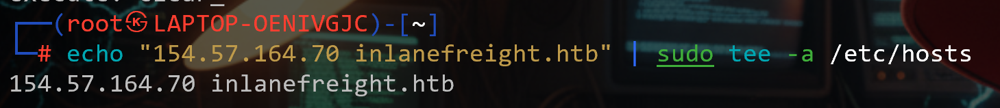
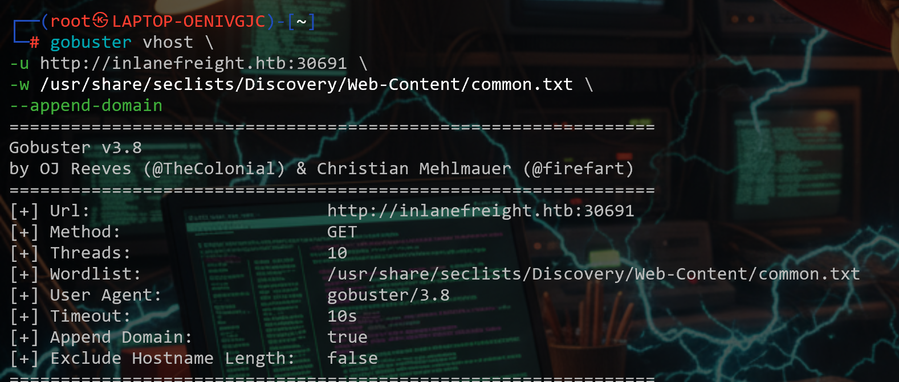
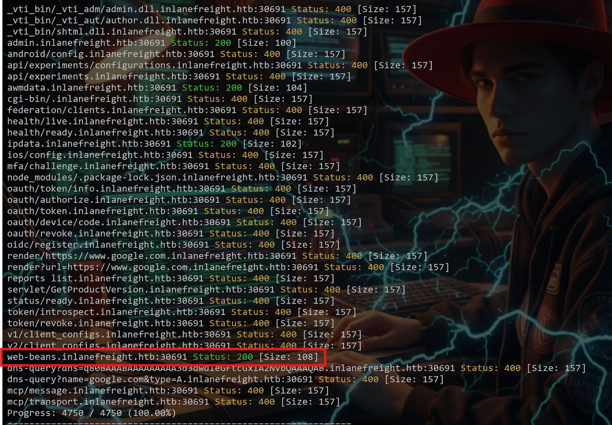
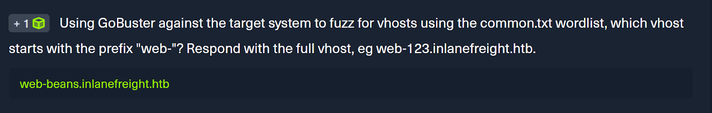
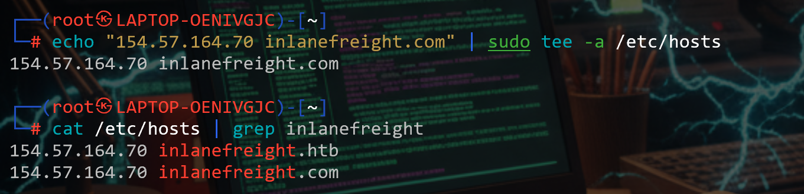
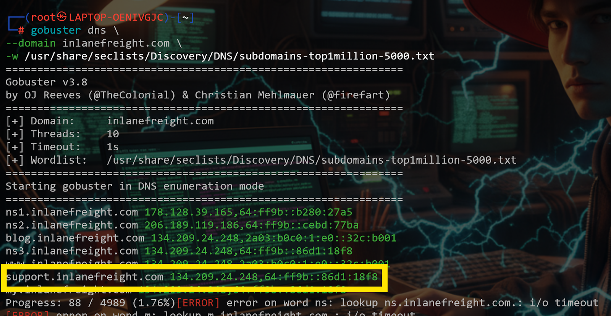
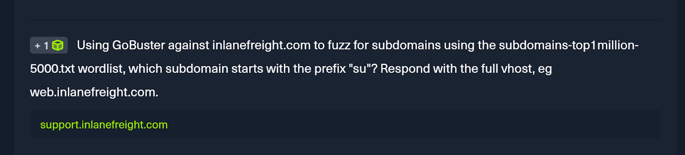

# Topic 3 — Virtual Host and Subdomain Fuzzing

> [← Back to Web Fuzzing](../README.md)

---

## 📖 Key Concepts

| Term | Meaning |
|------|---------|
| **VHost (Virtual Host)** | Multiple websites hosted on the same IP/server — found via `Host` header fuzzing |
| **Subdomain** | Part of a main domain — found via DNS resolution |
| **Gobuster VHost mode** | Used when multiple sites exist on one IP |
| **Gobuster DNS mode** | Used when you want to find subdomains via DNS |

---

## 🎯 Challenge 1 — Find the VHost starting with "web-"

### Step 1 — Add base domain to /etc/hosts
```bash
echo "IP  inlanefreight.htb" | sudo tee -a /etc/hosts
```


---

### Step 2 — Run Gobuster VHost fuzzing
```bash
gobuster vhost -u http://inlanefreight.htb \
  -w /usr/share/seclists/Discovery/DNS/common.txt \
  --append-domain
```


---

### Step 3 — Look for 200 OK status
Filter results for status 200.




---

## 🎯 Challenge 2 — Find subdomain starting with "su-"

### Step 1 — Add base domain to /etc/hosts
```bash
echo "IP  inlanefreight.com" | sudo tee -a /etc/hosts
```


---

### Step 2 — Run Gobuster DNS mode
```bash
gobuster dns -d inlanefreight.com \
  -w /usr/share/seclists/Discovery/DNS/subdomains-top1million-5000.txt
```



---

## 💡 Key Takeaway
Always add the target domain to `/etc/hosts` before VHost fuzzing. VHost fuzzing can reveal hidden admin panels, staging environments, and internal apps running on the same server.
