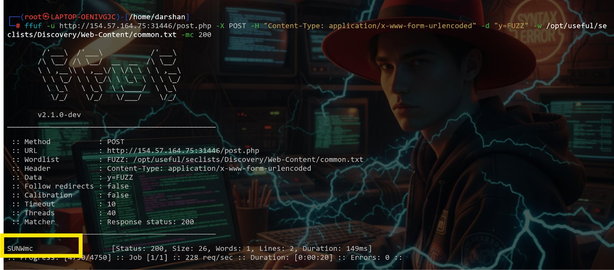
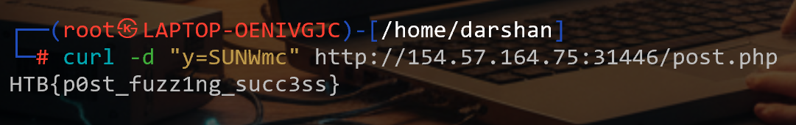

# Topic 4 — Filtering Fuzzing Output

> [← Back to Web Fuzzing](../README.md)

---

## 📖 Why Filtering Matters

Fuzzing tools generate a **lot** of results. Without filtering:
- 90% is junk (404 errors, same-size responses)

With filtering:
- Clean, meaningful results only

---

## 🛠️ Filter Flags Reference

| Tool | Flag | Filters by |
|------|------|-----------|
| Gobuster | `-s` | Specific status codes |
| Gobuster | `--exclude-length` | Response size |
| ffuf | `-mc` / `-fc` | Status code (match/filter) |
| ffuf | `-ms` / `-fs` | Response size |
| ffuf | `-mw` | Word count |
| ffuf | `-ml` | Line count |
| ffuf | `-mt` | Response time |
| ffuf | `-mc all` | Match all status codes |

---

## 🎯 Challenge — Find POST parameter flag with filtering

### Step 1 — Fuzz with size filtering to reduce noise
Use `-fs` to filter out responses of a specific size (the default "not found" response size).

Found the directory with the flag.



---

### Step 2 — Confirm flag with curl
```bash
curl -X POST "http://IP:PORT/post.php" \
  -d "y=SUNWmc"
```
- `-d "y=SUNWmc"` → sending the fixed known value



---

## 💡 Key Takeaway
Always filter by response size (`-fs`) to remove noise. Find the size of a "normal" wrong response first, then filter it out to see only real results.
