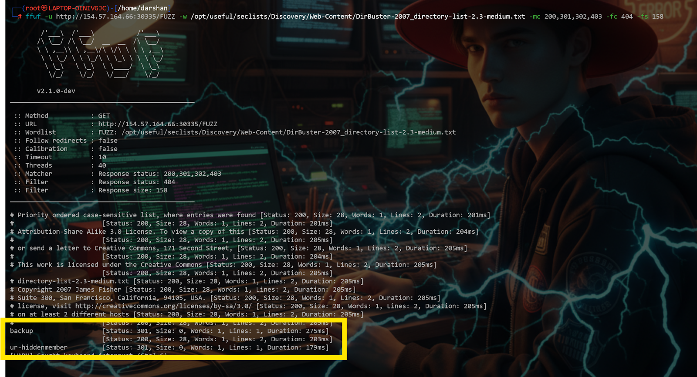
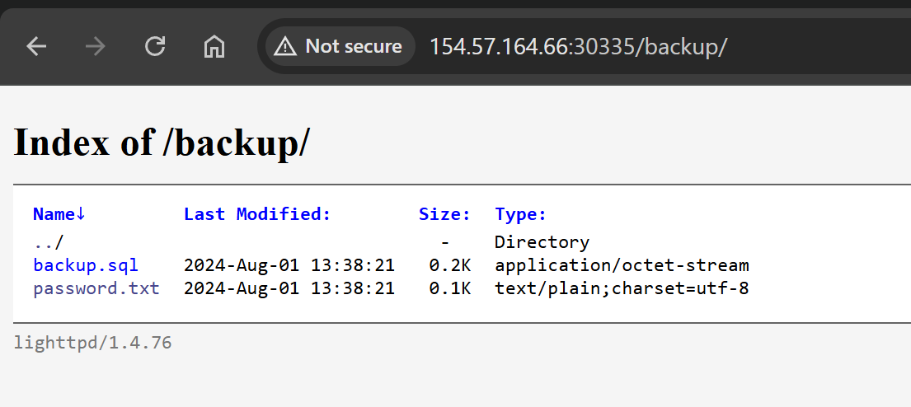
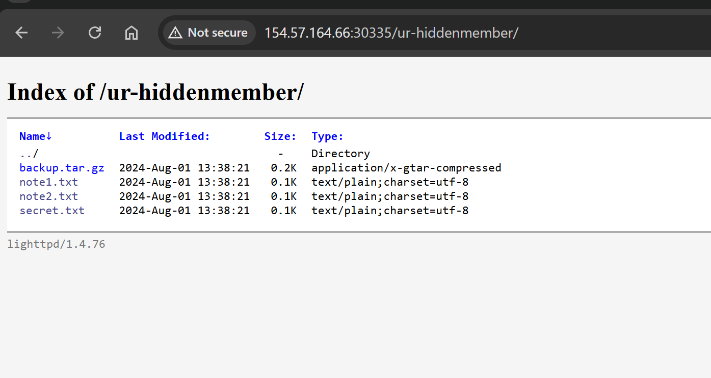
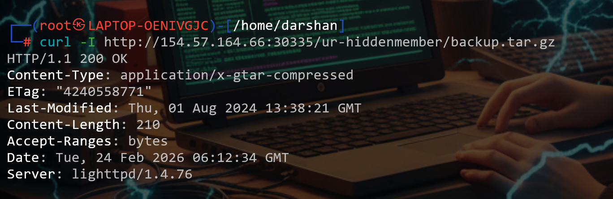

# Topic 5 — Validating Findings

> [← Back to Web Fuzzing](../README.md)

---

## 📖 What is Validation?

Validation means **confirming whether a finding is a real issue or just noise**.

### Why validation is important:
1. **Confirm it's real** → avoid reporting false positives
2. **Understand impact** → is it just exposed, or does it leak sensitive data?
3. **Reproduce reliably** → you should be able to trigger it again manually
4. **Collect proof safely** → enough evidence for reporting without damaging the system

---

## 🛠️ Manual Validation Method
```bash
curl http://IP:PORT/backup/
```
Why `/backup/` is dangerous — these folders may contain:
- Database dumps
- Password files
- Config files with API keys
- Source code

---

## 🎯 Challenge
> Fuzz the target using `directory-list-2.3-medium.txt`, find a hidden directory, then analyze the `tar.gz` file. Answer with the full `Content-Length` header.

---

### Step 1 — Fuzz for hidden directories
```bash
ffuf -w /usr/share/seclists/Discovery/Web-Content/directory-list-2.3-medium.txt \
  -u http://IP:PORT/FUZZ \
  -mc 200,301
```

Found two hidden directories:
1. `/backup/`
2. `/ur-hiddenmember/`



---

### Step 2 — Check each directory

**1. `/backup/`** → empty, nothing useful.



**2. `/ur-hiddenmember/`** → contains 4 items, including `backup.tar.gz` 🎯



---

### Step 3 — Get the Content-Length with curl -I
```bash
curl -I http://IP:PORT/ur-hiddenmember/backup.tar.gz
```
`-I` → sends a HEAD request and returns **only HTTP headers**, not the file body.



---

## 💡 Key Takeaway
Always validate findings manually — a `backup.tar.gz` in a hidden directory is a critical finding. Use `curl -I` to check file size and confirm existence without downloading the entire file.
