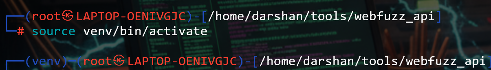
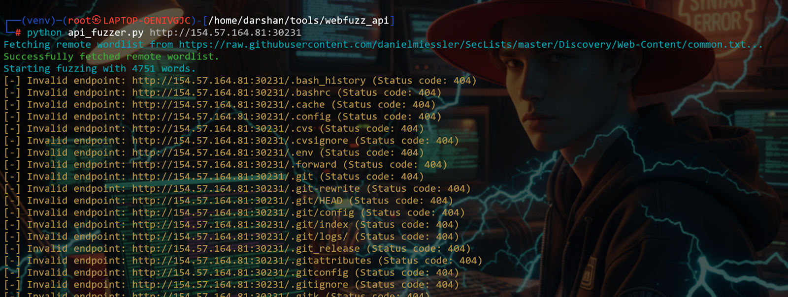
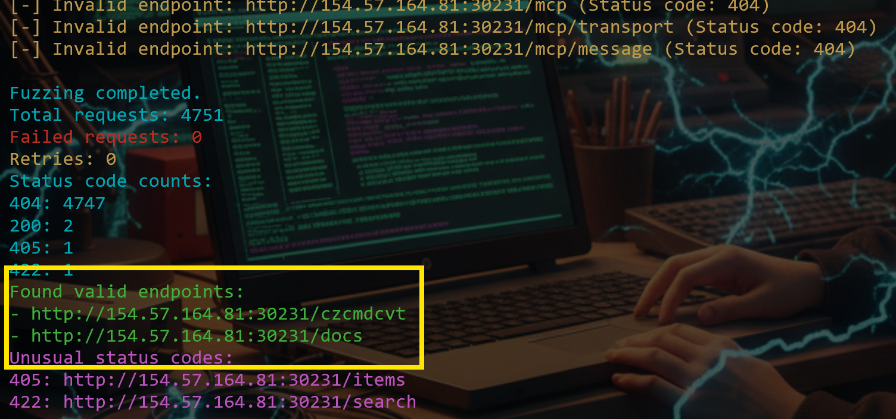
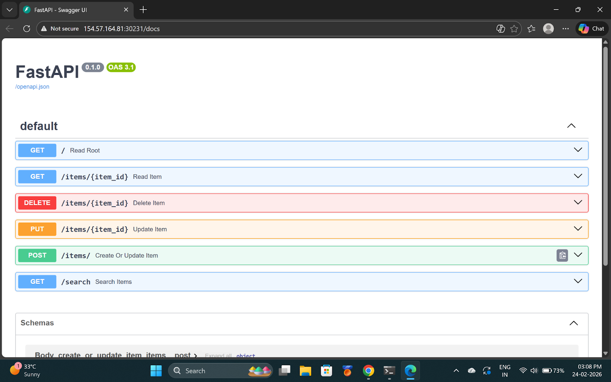
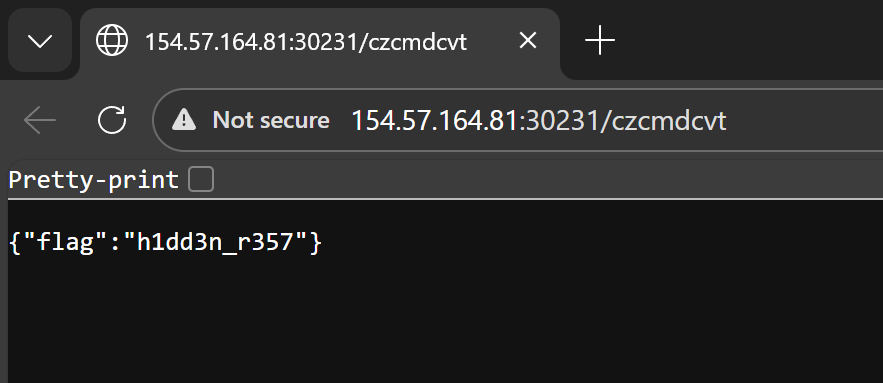

# Topic 6 — API Fuzzing

> [← Back to Web Fuzzing](../README.md)

---

## 📖 What is API Fuzzing?

API fuzzing means sending modified requests to API endpoints to find hidden endpoints, weak parameters, or logic flaws.

Example: `/api/users`

---

## 📋 3 Main Types of API Fuzzing

| Type | What you do |
|------|-------------|
| **Parameter fuzzing** | Modify query params, headers, JSON body values |
| **Data format fuzzing** | Break JSON or XML structure |
| **Sequence fuzzing** | APIs often require correct order: login → get token → access resource |

---

## 🌐 API Types Quick Reference

| Type | Description |
|------|-------------|
| **REST** | Uses HTTP methods — GET, POST, PUT, DELETE |
| **SOAP** | Older, structured, uses XML |
| **GraphQL** | Modern, flexible, single endpoint |

---

## 🎯 Challenge
> What is the value returned by the endpoint that the API fuzzer identifies?

---

### Step 1 — Install webfuzz_api
```bash
git clone https://github.com/PandaSt0rm/webfuzz_api.git
cd webfuzz_api
```

### Step 2 — Create a virtual environment
```bash
python3 -m venv venv
source venv/bin/activate
```



---

### Step 3 — Run the fuzzer
```bash
python3 api_fuzzer.py http://IP:PORT
```
Wait for the process to complete.




---

### Step 4 — Analyze discovered endpoints

Two valid endpoints found:
- `/docs/` → documentation



- `/czcmdcvt/` → **contains the flag** 🎯



---

## 💡 Key Takeaway
Standard directory wordlists miss API endpoints because APIs use unpredictable, non-dictionary paths. Use a dedicated API fuzzer that understands API structures — it finds endpoints that ffuf/gobuster would never discover.
